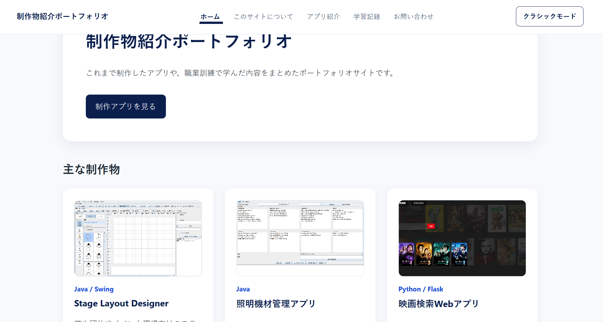
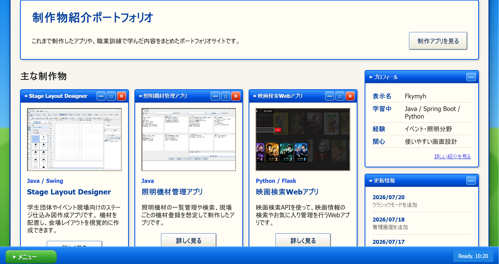

# 制作物紹介ポートフォリオ

これまでに制作したアプリと、職業訓練や個人学習で学んだ内容を紹介するポートフォリオサイトです。

Spring Bootの学習を目的として、画面遷移、フォーム処理、入力チェック、データベース保存、管理者認証などを実装しています。

## 公開サイト

ポートフォリオサイトをRenderで公開しています。

- [公開サイトを開く](https://fkymyh-portfoliosite.onrender.com/)

Renderの無料インスタンスを使用しているため、アクセスがない状態からの最初の表示には時間がかかる場合があります。

また、公開版ではH2 Databaseを使用しています。問い合わせ内容は永続保存されず、サービスの再起動、停止、再デプロイなどによって消える場合があります。

## 画面イメージ

### 通常モード



### クラシックモード



通常モードとクラシックモードを切り替えられ、選択したテーマはブラウザに保存されます。

## 制作目的

前職ではイベント現場に関わり、照明機材の設営や本番対応を経験しました。

その経験から、機材管理やステージレイアウトの共有を分かりやすくするアプリを制作しています。

このサイトでは制作物を並べるだけでなく、以下の内容が伝わることを目指しています。

- なぜ制作したのか
- どのような技術を使用したのか
- どこを工夫したのか
- どのような課題が残っているのか

## 紹介している制作物

### Stage Layout Designer

学生団体やイベント現場向けの、ステージ仕込み図作成アプリです。

- Java / Swing
- 機材の配置とドラッグ移動
- グリッド表示と吸着
- 保存・読み込み
- アプリとしてリリース済み
- GitHub Releasesからダウンロード可能

- [GitHubリポジトリ](https://github.com/Fkymyh/StageLayout-Designer)
- [最新版をダウンロード](https://github.com/Fkymyh/StageLayout-Designer/releases/latest)

### 照明機材管理アプリ

照明機材の在庫と現場での使用状況を管理するために制作したデスクトップアプリです。

- Java 21 / Swing
- 使用可能在庫の管理
- 現場ごとの使用機材の管理
- 故障・修理状況の管理
- Java実行環境を同梱したWindows版を公開済み
- GitHub Releasesからダウンロード可能

- [GitHubリポジトリ](https://github.com/Fkymyh/LightingManagementGUI)
- [最新版をダウンロード](https://github.com/Fkymyh/LightingManagementGUI/releases/latest)

### 映画検索Webアプリ

TMDB APIを利用して映画情報を検索・管理できる、Python / Flask製のWebアプリです。

- 映画検索
- マイリスト
- 視聴状況の管理
- 評価と感想の管理
- Renderで公開済み

- [公開アプリを開く](https://movie-manager-kv0u.onrender.com/)
- [GitHubリポジトリ](https://github.com/Fkymyh/movie-manager)

公開版は、すべての利用者が同じSQLiteデータを共有するデモ環境です。保存した内容は、サービスの再起動、停止、再デプロイなどによって消える場合があります。個人情報や重要な情報は入力しないでください。

## 使用技術

### バックエンド

- Java 21
- Spring Boot 4.1
- Spring MVC
- Spring Security
- Spring Data JPA
- Bean Validation
- H2 Database

### フロントエンド

- HTML
- CSS
- Thymeleaf
- JavaScript

### 開発・公開環境

- Eclipse
- Maven
- Git / GitHub
- Docker
- Render
- GitHub Releases

## 実装した機能

### 公開ページ

- ホーム画面
- このサイトについて
- 制作アプリ一覧
- 制作アプリごとの詳細ページ
- 学習記録
- パンくずリスト
- 現在ページの表示
- 共通ヘッダーとフッター
- 独自の404・500エラーページ
- スマートフォン表示への対応
- 通常モードとクラシックモードの切り替え
- 選択したテーマのブラウザ保存

### お問い合わせ

- お問い合わせフォーム
- 必須入力チェック
- メールアドレス形式チェック
- 件名とメッセージの文字数制限
- H2 Databaseへの保存
- 送信完了画面
- 画面更新による二重送信の防止

### 管理機能

- Spring Securityによるログイン認証
- 問い合わせ一覧
- 問い合わせ詳細表示
- 削除前の確認画面
- 問い合わせ削除
- ログアウト

管理画面は、認証済みの管理者だけが閲覧できます。

## 画面構成

```text
ホーム
├ このサイトについて
├ アプリ紹介
│ ├ Stage Layout Designer
│ ├ 照明機材管理アプリ
│ └ 映画検索Webアプリ
├ 学習記録
└ お問い合わせ
   └ 送信完了

管理画面
├ ログイン
├ 問い合わせ一覧
├ 問い合わせ詳細
└ 削除確認
```

## プロジェクト構成

```text
src/main/java/com/example/portfolio
├ config
├ controller
├ entity
├ form
├ repository
└ PortfolioSiteApplication.java

src/main/resources
├ static
│ ├ css
│ ├ images
│ └ js
├ templates
│ ├ error
│ ├ fragments.html
│ └ 各画面のHTML
├ application.properties
├ application-dev.properties
└ application-prod.properties

.dockerignore
dockerfile
pom.xml
```

Dockerイメージのビルドには、リポジトリ直下の`dockerfile`を使用します。ビルド環境と実行環境を分離したマルチステージビルドです。`.dockerignore`では、ビルドに不要なファイルやローカルDBを除外しています。

## ローカル起動

### 必要な環境

- Java 21
- Maven、またはプロジェクト付属のMaven Wrapper
- 環境変数を設定できる実行環境

### 管理者認証の設定

管理者IDとパスワードは、ソースコードや設定ファイルへ直接記載せず、以下の環境変数で管理します。

```text
PORTFOLIO_ADMIN_USERNAME
PORTFOLIO_ADMIN_PASSWORD
```

実際のIDやパスワードは、READMEやGitHubへ登録しません。

### Eclipseから起動する場合

1. プロジェクトをEclipseへインポートします。
2. `PortfolioSiteApplication.java`を開きます。
3. `Run Configurations`を開きます。
4. `Environment`タブで、以下の環境変数を設定します。

```text
PORTFOLIO_ADMIN_USERNAME=ローカル用の管理者ID
PORTFOLIO_ADMIN_PASSWORD=ローカル用の管理者パスワード
```

5. `Arguments`タブの`Program arguments`へ、以下を設定します。

```text
--spring.profiles.active=dev
```

6. `Run As`から`Spring Boot App`を実行します。
7. ブラウザで以下を開きます。

```text
http://localhost:8080/
```

### Maven Wrapperから起動する場合

Windowsでは、環境変数を設定してから起動します。

```powershell
$env:PORTFOLIO_ADMIN_USERNAME="ローカル用の管理者ID"
$env:PORTFOLIO_ADMIN_PASSWORD="ローカル用の管理者パスワード"
.\mvnw.cmd spring-boot:run "-Dspring-boot.run.profiles=dev"
```

実際に使用する管理者IDやパスワードをGitHubへ登録しないでください。

## 開発用と公開用の設定

### devプロファイル

```text
--spring.profiles.active=dev
```

開発時のみ、以下を有効にします。

- H2 Console
- SQLログ

H2 Console：

```text
http://localhost:8080/h2-console
```

### prodプロファイル

```text
--spring.profiles.active=prod
```

公開用設定では、以下を無効にします。

- H2 Console
- SQLログ

H2 ConsoleとそのSpring Security設定は、`dev`環境だけで有効になります。Renderでは`prod`プロファイルを使用します。

## Renderへのデプロイ

このポートフォリオサイトは、次の設定でRenderへデプロイしています。

| 項目 | 設定値 |
| --- | --- |
| Runtime | Docker |
| Dockerfile Path | `./dockerfile` |
| Health Check Path | `/` |
| Instance Type | Free |

Renderでは、以下の環境変数を設定します。

```text
SPRING_PROFILES_ACTIVE=prod
PORTFOLIO_ADMIN_USERNAME=公開環境用の管理者ID
PORTFOLIO_ADMIN_PASSWORD=公開環境用の管理者パスワード
```

実際の値はGitHubへ登録せず、Renderの環境変数として管理します。

アプリケーションのポート設定は、次のとおりです。

```properties
server.port=${PORT:8080}
```

`PORT`はRenderが自動設定します。ローカルなどで`PORT`が設定されていない場合は、既定値として`8080`を使用します。

## H2データベース

ローカル環境と現在の公開版では、H2 Databaseを使用しています。

お問い合わせフォームは、Spring MVC、入力チェック、Spring Data JPA、管理画面などの学習成果を示すためのデモ機能です。

Renderの無料インスタンスではローカルファイルが永続化されないため、H2へ保存した問い合わせ内容は、サービスの再起動、停止、再デプロイなどによって消える場合があります。

将来、問い合わせ内容の永続保存が必要になった場合は、PostgreSQLなどの外部データベースへの移行を検討します。

## セキュリティ上の対応

- 管理画面をSpring Securityで保護
- 管理者IDとパスワードを環境変数で管理
- 問い合わせ一覧・詳細・削除を管理者だけに制限
- CSRF対策を有効化
- 削除処理をPOSTで実行
- H2 Consoleを`dev`環境だけで有効化
- Renderでは`prod`プロファイルを使用
- 外部リンクへ`noopener noreferrer`を設定
- DBファイルと問い合わせデータをGit管理から除外

## Git管理から除外するファイル

問い合わせ内容やローカルDBをGitHubへ登録しないよう、以下を除外しています。

```gitignore
data/
*.mv.db
*.trace.db
```

Dockerのビルド対象からも、`.dockerignore`によってローカルDBなどを除外しています。

## 今後の改善

- 管理画面の検索
- 問い合わせの既読・未読管理
- アクセシビリティ改善
- 自動テストの拡充
- エラーログと監視
- 必要になった場合のPostgreSQL移行
- 公開中アプリの継続的な改善

## 開発におけるAI活用について

制作するアプリの目的、解決したい問題、必要な機能、画面構成は自分で考えました。

AIは、実装方法の調査、コードレビュー、エラー原因の整理、READMEや画面説明文の文章整理など、開発を進めるための補助として利用しています。

AIから提案された内容はそのまま採用せず、プロジェクトに合わせて実際に動作を確認しています。意図した動作や構成と異なる部分については、内容を確認したうえで修正しました。

今後は、実装したコードへの理解をさらに深め、自力で設計・実装・修正・説明できる範囲を広げることを目標にしています。

## 参考資料

- 職業訓練で使用したJava、Servlet/JSP、Spring Frameworkの教材
- とほほのWWW入門
- Spring公式ドキュメント
- GitHub Docs
- [Docker公式ドキュメント](https://docs.docker.com/)
- [Render Docs](https://render.com/docs)

## 注意事項

- このプロジェクトは、学習およびポートフォリオ用途で公開しています。
- Renderの無料インスタンスを使用しているため、アクセスがない状態からの初回表示に時間がかかる場合があります。
- 問い合わせ内容は永続保存されず、再起動、停止、再デプロイなどによって消える場合があります。
- 管理者IDやパスワードはGitHubへ登録しません。
- 公開環境の秘密情報は、Renderの環境変数で管理します。
